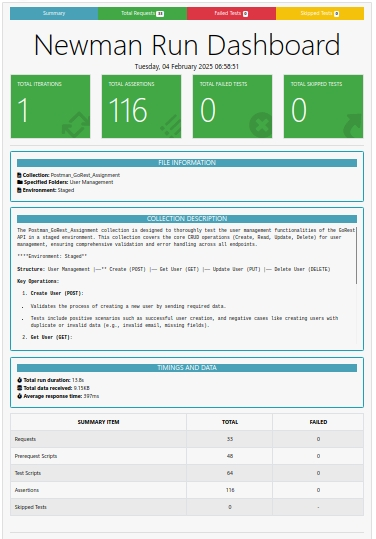

# Postman API Automation Project

## Project Overview
This project automates API testing using **Postman** and **Newman**. It includes collections for testing various API functionalities, such as User Management, external data-driven tests using CSV files, and mock server testing.

## 📂 Directory Structure
```
E2E_flow_advance_postman_methods/
├── README.md
├── booksData - Sheet1.csv
├── Collections/
│   ├── Library_Using_CSV.postman_collection.json
│   ├── MockEndPoint.postman_collection.json
│   └── Postman_GoRest_Assignment.postman_collection.json
├── Environment Files/
│   ├── MockEndPoint.postman_environment.json
│   ├── QA.postman_environment.json
│   ├── Staged.postman_environment.json
│   ├── UAT.postman_environment.json
│   └── workspace.postman_globals.json
└── .github/
    └── workflows/
        └── api.yaml
```

## Setup Instructions
### **1️⃣ Clone the Repository**
```sh
git clone <repository-url>
cd amaninreal-e2e_flow_advance_postman_methods
```

### **2️⃣ Install Dependencies**
Ensure you have **Node.js** installed, then install Newman:
```sh
npm install -g newman newman-reporter-htmlextra
```

### **3️⃣ Run Postman Collections Locally**
#### Run User Management Tests
```sh
newman run "Collections/Postman_GoRest_Assignment.postman_collection.json" \
  --environment "Environment Files/Staged.postman_environment.json" \
  --folder "User Management" \
  --reporters cli,htmlextra \
  --reporter-htmlextra-export ./newman_reports/user_management_report.html
```

#### Run API Tests with CSV Data
```sh
newman run "Collections/Library_Using_CSV.postman_collection.json" \
  --environment "Environment Files/UAT.postman_environment.json" \
  -d "booksData_Sheet1.csv" \
  --reporters cli,htmlextra \
  --reporter-htmlextra-export ./newman_reports/external_data_csv_report.html
```

#### Run Mock Server Tests
```sh
newman run "Collections/MockEndPoint.postman_collection.json" \
  --environment "Environment Files/MockEndPoint.postman_environment.json" \
  --reporters cli,htmlextra \
  --reporter-htmlextra-export ./newman_reports/mock_test_report.html
```

## 🌍 Environments Used
This project uses multiple environments for different testing scenarios:
- **UAT** - User Acceptance Testing
- **STAGED** - Staging Environment
- **QA** - Quality Assurance
- **MockEndPoint** - Mock API Testing

## ⚙️ CI/CD Pipeline with GitHub Actions
This project includes a GitHub Actions workflow (`api.yaml`) to automatically run Postman collections on:
- **Push to `main` or `issue-*` branches**
- **Pull requests to `main` or `issue-*` branches**
- **Scheduled daily runs**

### **Workflow Configuration**
Located at `.github/workflows/api.yaml`, the pipeline performs:
1. **Checkout repository**
2. **Set up Node.js**
3. **Install Newman & HTML Reporter**
4. **Run API tests and generate reports**
5. **Trigger Postman Monitor**
6. **Upload test reports as artifacts**

### **Triggering the Workflow Manually**
You can manually trigger the GitHub Actions workflow from the repository’s **Actions** tab.

## 📊 Reports & Logs
Test execution reports are generated in `newman_reports/`, and GitHub Actions logs are available under **Actions → Workflow Runs**.

**User Management**



## 📝 Contribution Guidelines
1. **Fork the repository** and create a feature branch.
2. **Commit changes** with meaningful messages.
3. **Submit a pull request** for review.


